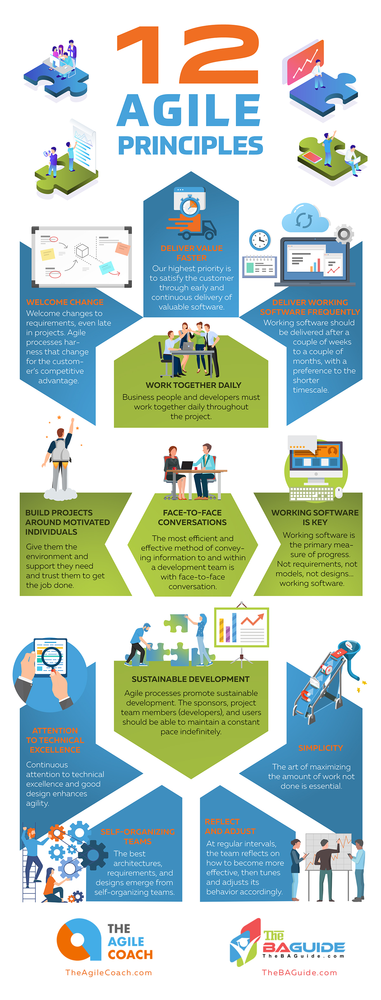

## Agile Principles

- Deliver Value Faster
- Welcome Change
- Deliver Working Software Frequently
- Work Together Daily (Businesses and Developers collaboration)
- Build Projects Around motivated Individuals.
- Face to Face conversations.
- Working Software is key.
- Sustainable development.
- Attention to technical excellence.
- Simplicity
  - The art of maximizing the amount of work **not** done is essential.
- Self-Organizing Teams
- Reflect and Adjust
