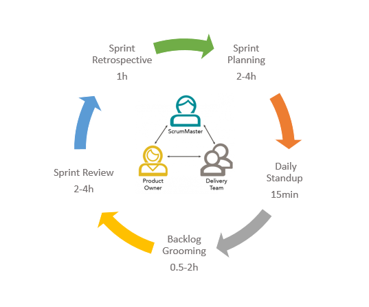

## Ceremonies and Events

### Daily Stand-Up Meeting

It's a quick **15 minutes to do inspect and adapt.**

- What did you do yesterday?
- What are you gonna today?
- Do you have any impediments?

### Sprint Planning Meeting

#### Sprint Planning Checklist

What:

- Do user stories all contain who, what and why?
- Are we clear on the acceptance criteria of each story?
- Have you split large stories into small ones and estimated them?
- Do you have enough stories for team members to work on for the sprint?
- Is the priority on the stories clear and understood by everyone?
- Are the stories on the sprint backlog independent (not dependent upon other stories)?
- Does the whole team agree on the sprint commitment?
- Has the team considered PTO (paid time off) and holidays of team members while
determining the sprint commitment?
- Does the team have a Sprint Goal?

How:

- Does the team have a shared understanding of Definition of Done?
- Are there any impediments the team can proactively work on that can help the team to
achieve flow?
- Does every member understand what needs to be done on their respective stories to meet
the acceptance criteria?
- Can team members agree to work on a single story at a time (to avoid context switching)?
- Are there any knowledge silos or gaps where a task can be done by only one person?
- If so, does the team have a plan to share that knowledge with everyone so that
everyone in the team can work on that task.
- Have you put the (most urgent) retrospective action item from the last sprint in this sprint?

### Sprint Review

A Sprint Review is held at the end of the Sprint to inspect the Increment and adapt the Product Backlog if needed. There could have been a single  deployment or many deployments during a Sprint which lead up to that Increment to be inspected.

During the Sprint Review, the Scrum Team and stakeholders collaborate about what was done in the Sprint. Based on that and any changes to the Product Backlog during the Sprint, attendees collaborate on the next things that could be done to optimize value. This is an informal meeting, not a status meeting, and the presentation of the Increment is intended to elicit feedback and foster collaboration.

This is at most a four-hour meeting for one-month Sprints. For shorter Sprints, the event is usually shorter. The Scrum Master ensures that the event takes place and that attendees understand its purpose. The Scrum Master teaches everyone involved to keep it within the time-box.

The Sprint Review includes the following elements:

- Attendees include the Scrum Team and key stakeholders invited by the Product Owner.
- The Product Owner explains what Product Backlog items have been “Done” and what has not been “Done”.
- The Development Team discusses what went well during the Sprint, what problems it ran into, and how those problems were solved.
- The Development Team demonstrates the work that it has “Done” and answers questions about the Increment.
- The Product Owner discusses the Product Backlog as it stands. He or she projects likely target and delivery dates based on progress to date (if needed).
- The entire group collaborates on what to do next, so that the Sprint Review provides valuable input to subsequent Sprint Planning.
- Review of how the marketplace or potential use of the product might have changed what is the most valuable thing to do next.
- Review of the timeline, budget, potential capabilities, and marketplace for the next anticipated releases of functionality and capability of the product.

### Sprint Retrospective

During the Sprint Retrospective, the team discusses:

- What went well in the Sprint
- What could be improved
- What will we commit to improve in the next Sprint

The Scrum Master encourages the Scrum Team to improve its development process and practices to make it more effective and enjoyable for the next Sprint. During each Sprint Retrospective, the Scrum Team plans ways to increase product quality by improving work processes or adapting the definition of “Done” if appropriate and not in conflict with product or organizational standards.

### Backlog Grooming

Backlog grooming is when the product owner and some, or all, of the rest of the team review items on the backlog to ensure the backlog contains the appropriate items, that they are prioritized, and that the items at the top of the backlog are ready for delivery. This activity occurs on a regular basis and may be an officially scheduled meeting or an ongoing activity. Some of the activities that occur during this refinement of the backlog include:

- removing user stories that no longer appear relevant
- creating new user stories in response to newly discovered needs
- re-assessing the relative priority of stories
- assigning estimates to stories which have yet to receive one
- correcting estimates in light of newly discovered information
- splitting user stories which are high priority but too coarse grained to fit in an upcoming iteration
