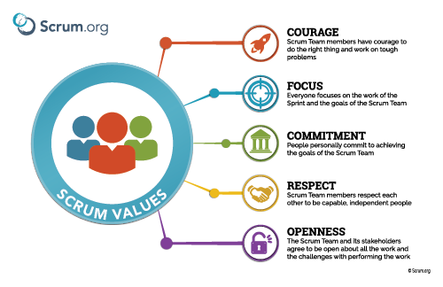

## Scrum Overview

In summary, Scrum is an Agile way of developing software or any project.

Lightweight framework designed to solve complex problems that required sprinting or iterating through a solution.

Values:

- Inspection
- Adaption
- Transparency

\
\


## Scrum roles

### The Development Team
- Build product increment
- Self organizing
- Cross functional
- **Three to nine** people

### The Scrum Master
Ensures scum is understood and used skillfully by scrum team.
He is a servant leader.
Models agile mindset and scrum framework.


### The Product Owner
Understand users and visions the product.
Writes a simple description of the product feature from a user's perspective. **user stories**

```
As a <End User Role>
I want to <desired action>
so that <desired benefit>
```
