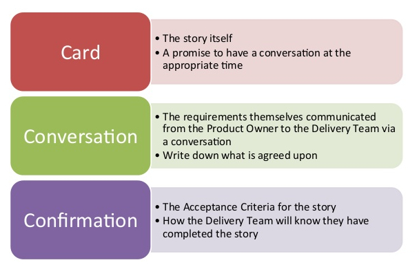

## User stories

A user story is simple description of a product feature that is written from end user's point of view.

### User story format


```
As a <End User Role>
I want to <desired action>
so that <desired benefit>
```

### The 3 C's acronym



### Acceptance Criteria

Are simple notes or conditions added to user story, that tell what the user story must to do to satisfy the needs of the customer.

Product Owner writes the initial Acceptance Criteria and brings them to the team.

Acceptance Criteria should be:

- Testable with pass/fail results
- Clear and concise
- Created with shared understanding

Great user stories are:

1. Independent
2. Negotiable
3. Valuable
4. Estimable
5. Small
6. Testable
